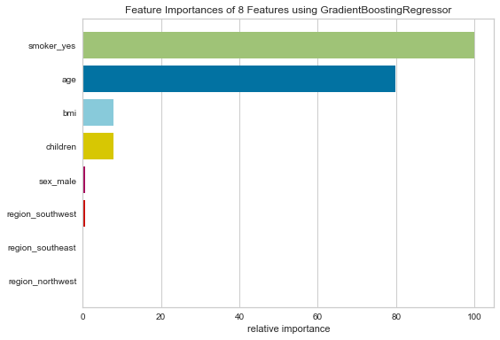

# Insurance

## Demostración


## Descripción

El seguro de vida es una cobertura de riesgo que se aplica a una persona que está en un estado de emergencia, como un accidente de tránsito, una enfermedad grave, etc.

* ¿Qué problema resuelve?

    A veces puede resultar difícil conocer cuánto costará tener un seguro de salud contratado, ya que depende de muchas variables, por lo que este proyecto, tiene como fin entregar un estimado de cuánto podría ser este costo, dependiendo de los datos que se tienen sobre el costo que están pagando otras personas.

    De esta manera, ingresando los datos de la persona, el sistema puede calcular el costo estimado de un seguro de vida de manera anual.

* ¿Qué tecnologías y librerías se usan?

    El proyecto está realizado completamente en Python, utilizando diferentes librerías, las que se detallan a continuación.

    [Pandas:](https://pandas.pydata.org) Es una herramienta open source rápida, poderosa, flexible y fácil de usar, la cual nos permite manipular y analizar datos.

    [Numpy:](https://numpy.org/) Es una librería de Python que nos permite trabajar con arrays y matrices.

    [Matplotlib:](https://matplotlib.org/) Es una librería de Python que nos permite crear gráficos.

    [Seaborn:](https://seaborn.pydata.org/) Es una librería de Python que nos permite crear gráficos sobre matplotlib, de una manera más sencilla.

    [Scikit-learn:](https://scikit-learn.org/) Es una librería de Python que nos permite trabajar con modelos de machine learning.

    [Streamlit](https://streamlit.io) Es una librería de Python que nos permite crear de manera sencilla aplicaciones web, generalmente utilizada para crear demostraciones.

## Tabla de contenidos

[Instalación](#instalación)

## Instalación

Para poder replicar este proyecto de manera local, se debe ejecutar los siguientes comandos en la terminal:

1. Clonar de manera local el repositorio.

```
git clone https://github.com/Gab0Jorq/insurance.git
```

2. Crear un entorno virtual y activarlo.

    Windows:

    ```
    python -m venv venv
    ```
    ```
    .\venv\Scripts\activate
    ```

    Linux:
    ```
    python3 -m venv venv
    ```
    ```
    source venv/bin/activate
    ```
3. Instalar las librerías requeridas, a través de requirements.txt.

```
pip install -r requirements.txt
```

## Utilización de la aplicación

Para utilizar la aplicación lo puede hacer de dos maneras, usándola de manera local, utilizando el siguiente código dentro del terminal, en el ambiente del proyecto.

```
streamlit run app.py
```

También puede utilizarlo de manera online, ingresando a la siguiente [Web](https://share.streamlit.io/gab0jorq/insurance/app.py)

## Principales descubrimientos

Las variables utilizadas en este proyecto, afectan de diferentes maneras, dentro del análisis exploratorio se descubrió lo siguiente:
### Children
 
* Las personas que tienen mayores costos son las que tienen 2 hijos, y las que menos las que tienen 5 hijos, sin embargo, puede que esto no sea tan real, ya que las personas que tienen 4 o 5 hijos son muy pocas, entonces puede que no sea representativo.

### BMI
 
* La región **`Southeast`** es la que tiene gente con mayor BMI.
* La región que más gasta en seguros, coincide con la de mayor BMI.

### Smoker

* Las personas que son fumadoras pagan mucho más que las personas que no lo son.
* La edad promedio de las personas fumadoras comparado con las no fumadoras, son muy similares, en torno a los 38 años.

### Importancia de las variables

Luego de elegir el modelo que mejor se comporta con los datos, se obtuvo el gráfico de las variables que influyen en el costo del seguro de vida, siendo la más importante si la persona fuma, seguido de la edad, BMI e hijos.



### Otras

Si quiere ver el análisis completo del proyecto, puede ingresar al  [jupyter notebook](https://github.com/Gab0Jorq/insurance/blob/master/insurance.ipynb).